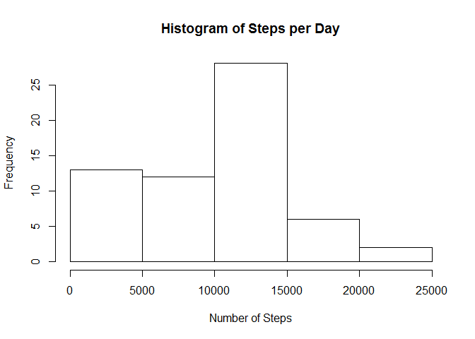
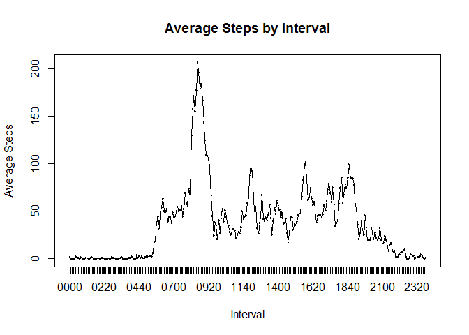
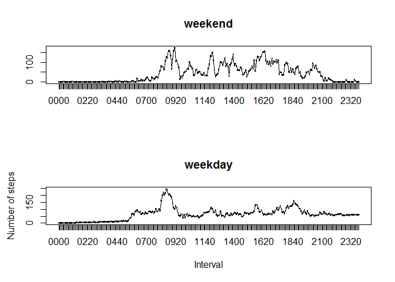

# Reproducible Research: Peer Assessment 1

## Loading and preprocessing the data

This code assumes that the zip file for the assignment is in the current
working directory.


```r
unzip("activity.zip", overwrite = TRUE)

activity <- read.csv("activity.csv")
```

## What is mean total number of steps taken per day?


```r
stepsPerDay <- aggregate(
    activity$steps, by=list(activity$date), FUN=sum, na.rm=TRUE)

names(stepsPerDay) <- list("date", "steps")

hist(stepsPerDay$steps,
    main="Histogram of Steps per Day", xlab="Number of Steps")
```

 

Mean of total steps taken per day.


```r
mean(stepsPerDay$steps)
```

```
## [1] 9354.23
```

Median of total steps taken per day.


```r
median(stepsPerDay$steps)
```

```
## [1] 10395
```

## What is the average daily activity pattern?


```r
intvlFactor <- factor(sprintf("%04d", activity$interval))

meanStepsByIntvl <- aggregate(
    activity$steps, by=list(intvlFactor), FUN=mean, na.rm=TRUE)

names(meanStepsByIntvl) <- list("interval", "steps")

plot(meanStepsByIntvl$interval, meanStepsByIntvl$steps, type="n",
     main="Average Steps by Interval", xlab="Interval", ylab="Average Steps")

lines(meanStepsByIntvl$interval, meanStepsByIntvl$steps, type="l")
```

 

Interval with maximum average number of steps per day.


```r
maxStepsRowNum = which.max(meanStepsByIntvl$steps)

as.character(meanStepsByIntvl[maxStepsRowNum, 1])
```

```
## [1] "0835"
```

## Imputing missing values

Total number of rows with missing values.


```r
rowsMissingValues = !complete.cases(activity)
sum(rowsMissingValues)
```

```
## [1] 2304
```

To fill in all of the missing values in the dataset, we'll substitute each
missing value with the average value for that time interval.


```r
intervalsMissingValues <- activity[rowsMissingValues, 3]

meanStepsByIntvl <- aggregate(
    activity$steps, by=list(activity$interval), FUN=mean, na.rm=TRUE)

names(meanStepsByIntvl) <- list("interval", "steps")

substituteValues <- meanStepsByIntvl[
    meanStepsByIntvl$interval == intervalsMissingValues, 1]

imputedActivity <- activity
imputedActivity[rowsMissingValues, 1] <- substituteValues
```

Mean of total steps taken per day for imputed data.


```r
stepsPerDay <- aggregate(
    imputedActivity$steps, by=list(imputedActivity$date), FUN=sum, na.rm=TRUE)

names(stepsPerDay) <- list("date", "steps")

mean(stepsPerDay$steps)
```

```
## [1] 14913.57
```

Median of total steps taken per day for imputed data.


```r
median(stepsPerDay$steps)
```

```
## [1] 10439
```

## Are there differences in activity patterns between weekdays and weekends?


```r
activityWeekends <-
    weekdays(as.Date(imputedActivity$date)) %in% list("Saturday", "Sunday")

colNames <- names(imputedActivity)

imputedActivity[activityWeekends, 4] <- "weekend"
imputedActivity[!activityWeekends, 4] <- "weekday"

names(imputedActivity) <- c(colNames, "daytype")

imputedActivity$daytype <- as.factor(imputedActivity$daytype)

weekendActivity = imputedActivity[imputedActivity$daytype == "weekend",]

weekendIntvlFactor <- factor(sprintf("%04d", weekendActivity$interval))

weekendMeanStepsByIntvl <- aggregate(
    weekendActivity$steps, by=list(weekendIntvlFactor), FUN=mean, na.rm=TRUE)

names(weekendMeanStepsByIntvl) <- list("interval", "steps")

weekdayActivity = imputedActivity[imputedActivity$daytype == "weekday",]

weekdayIntvlFactor <- factor(sprintf("%04d", weekdayActivity$interval))

weekdayMeanStepsByIntvl <- aggregate(
    weekdayActivity$steps, by=list(weekdayIntvlFactor), FUN=mean, na.rm=TRUE)

names(weekdayMeanStepsByIntvl) <- list("interval", "steps")

par(mfrow=c(2, 1))

plot(weekendMeanStepsByIntvl$interval, weekendMeanStepsByIntvl$steps, type="n",
     main="weekend", xlab=NULL, ylab=NULL)

lines(weekendMeanStepsByIntvl$interval, weekendMeanStepsByIntvl$steps, type="l")

plot(weekdayMeanStepsByIntvl$interval, weekdayMeanStepsByIntvl$steps, type="n",
     main="weekday", xlab=NULL, ylab=NULL)

lines(weekdayMeanStepsByIntvl$interval, weekdayMeanStepsByIntvl$steps, type="l")

mtext("Number of steps", side=2, line=3, padj=0.5)
mtext("Interval", side=1, line=3)
```

 
